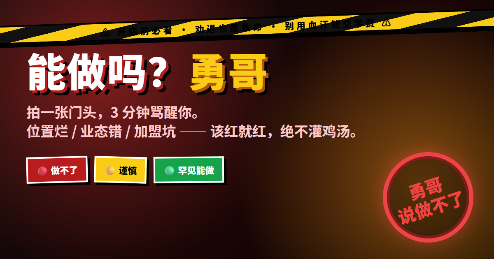
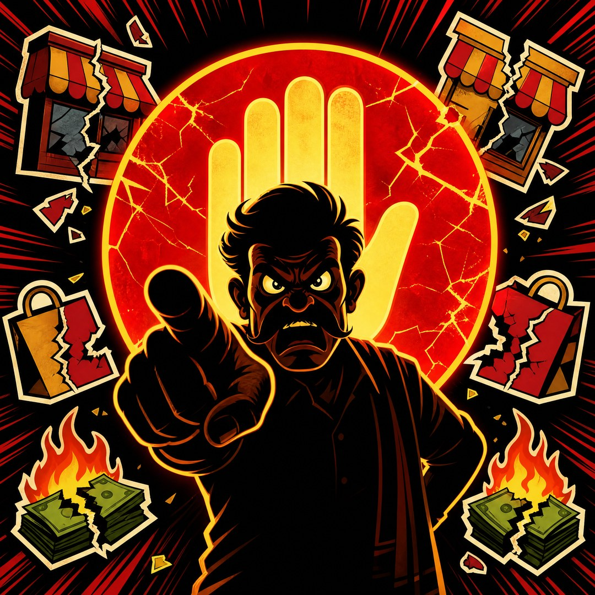
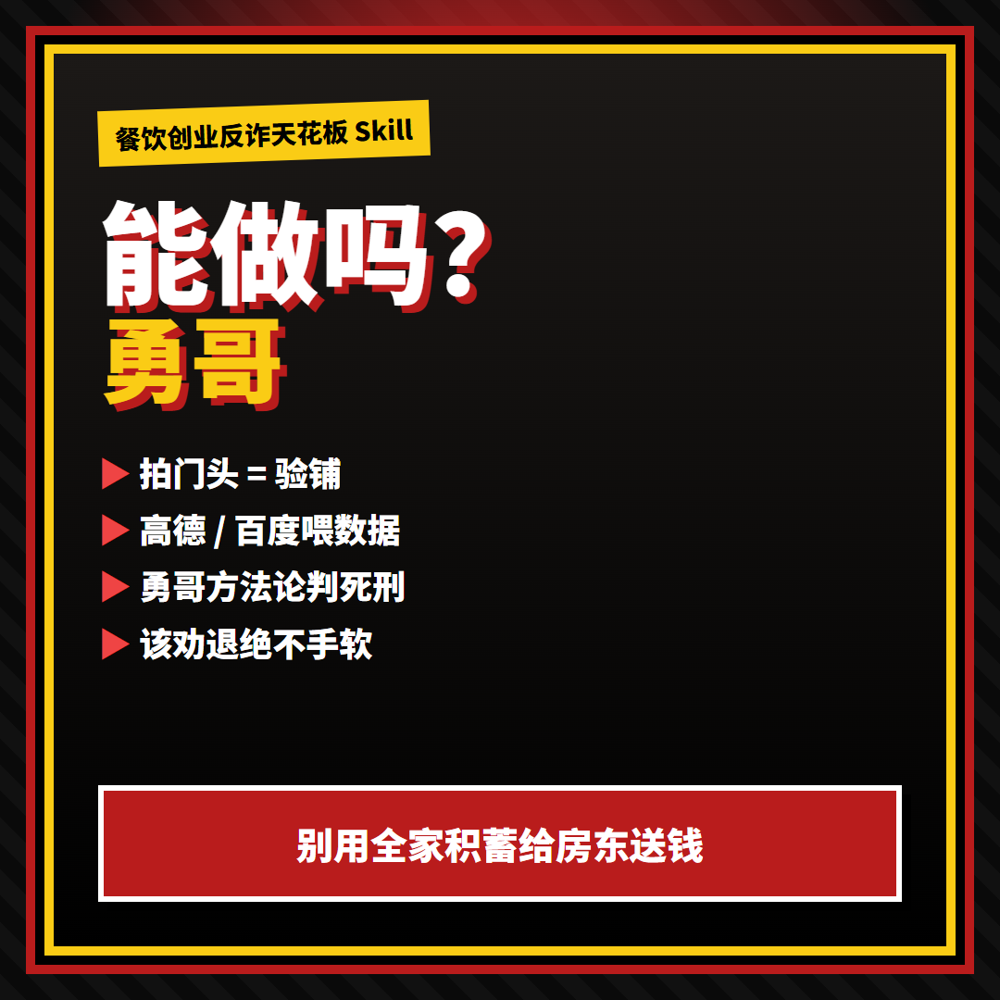

<p align="center">
  
</p>

<h1 align="center">能做吗？勇哥</h1>

<p align="center">
  <b>拍一张门头，3 分钟骂醒你。</b><br/>
  位置烂 · 业态错 · 加盟坑 —— <b>该红就红，绝不灌鸡汤</b>
</p>

<p align="center">
  
  
  
</p>

<p align="center">
  
  
  
  
</p>

<p align="center">
  
</p>

<p align="center">
  
</p>

---

## 先骂一句

> **别急着加盟。别急着交转让费。别用全家积蓄给房东送钱。**

「能做吗？勇哥」干一件很不讨喜的事：

# **在你掏钱之前，先把你劝退。**

> 勇哥说能做的，不能保证赚钱。  
> **勇哥说做不了的，一定亏钱。**

不是陪聊。是 **验铺行刑队**。

<p align="center">
  
  
</p>

---

## 30 秒懂

| 你丢进来 | 它砸回去 |
|----------|----------|
| 门头 / 街景照 | 楼层？台阶？遮挡？棺材铺？毒打 |
| 地址 | 高德扫同业 / 学校 / 大牌（百度兜底） |
| 「加盟 60 万全国首家汉堡」 | 🔴 + 为什么 + 今天就停 |

```text
你：全国首家××汉堡，总投入 60 万+，吾悦边上

哥：🔴 做不了。这笔加盟今天就停。
    · 「全国首家」= 你是小白鼠
    · 汉堡四件套高压区
    · 同走廊塔斯汀/麦当劳/华莱士，你拿什么打？
```

**爽点不在教你发财，在拦你倾家荡产。**

---

## 标题党武器库（直接抄）

1. 拍一张门头，3 分钟骂醒你  
2. 勇哥说做不了：这座铺别签  
3. 全国首家？先把 60 万放下  
4. 别用全家积蓄给房东送钱  
5. 高德扫完街，勇哥判死刑  
6. 餐饮创业反诈：验铺比配方重要  

**电梯稿（狠）**  
别人教你怎么开店。我们教你 **怎么别开**。  
这是开店前的 **验孕棒**：两分钟看你中没中招。

---

## 架构（一句话）

```text
门头照 + 地址
    → 看图毒打 + 高德(主)/百度(备) 供血
    → 勇哥方法论唯一大脑
    → 🔴🟡🟢 + 换业态 + 下一步
```

---

## 安装

```bash
git clone https://github.com/turnerzhan/nengzuoma-yongge.git
# → ~/.grok/skills/nengzuoma-yongge/  或其它 Agent skills 目录
```

| 依赖 | |
|------|--|
| 多模态看图 | 必须 |
| 高德 MCP | 强推 |
| 百度 MCP | 兜底 |
| Banana Image2 | 仅再生成视觉物料时需要 |

触发：`/nengzuoma-yongge` · 「能做吗」· 「勇哥看这个铺」· 直接砸门头图

---

## 视觉物料（Image2）

| 文件 | 用途 |
|------|------|
| `docs/assets/logo.png` | 砸章 Logo（Banana `gpt-image-2`） |
| `docs/assets/cover-banner.jpg` | 横版封面 |
| `docs/assets/hook-card.jpg` | 话题方图 |
| `docs/assets/poster-hero.png` | 中文大字横海报 |
| `docs/assets/poster-square.png` | 中文方海报 |

重生成：

```bash
# 需 projects/qian/.env 里 BANANA_API_KEY
python scripts/gen_banana_assets.py
```

---

## 仓库 ID 说明

GitHub **仓库名不吃汉字**（会剥成 `-`）。  
品牌叫 **能做吗？勇哥**，克隆用 `nengzuoma-yongge`。

---

## 边界

决策辅助，非投资/法律建议。  
与勇哥本人及原机构 **无官方关系**。  
方法论可参考社区整理 [yongge-restaurant-skill](https://github.com/Astro-wen/yongge-restaurant-skill)（非官方关联）。

## License

MIT

---

<p align="center">
  <b>能做吗？勇哥。</b><br/>
  做不了的 —— <b>今天就停。</b>
</p>
